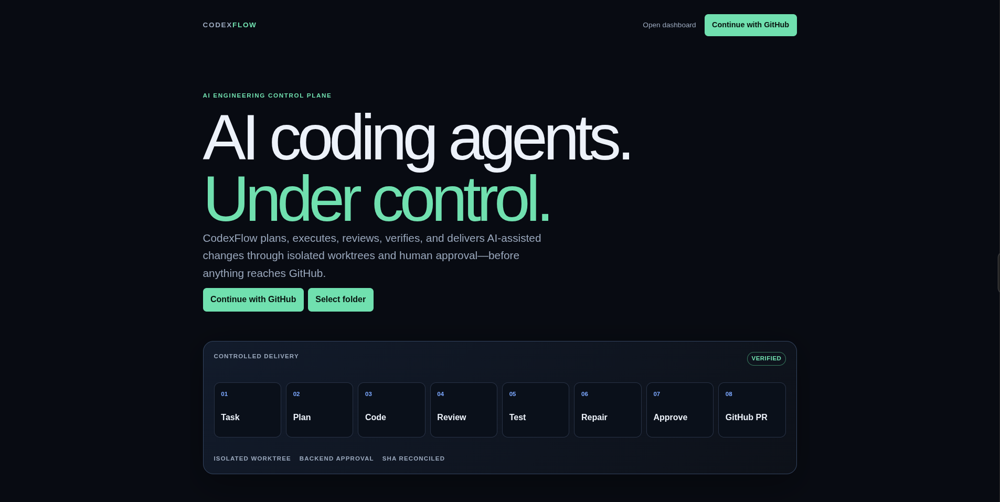
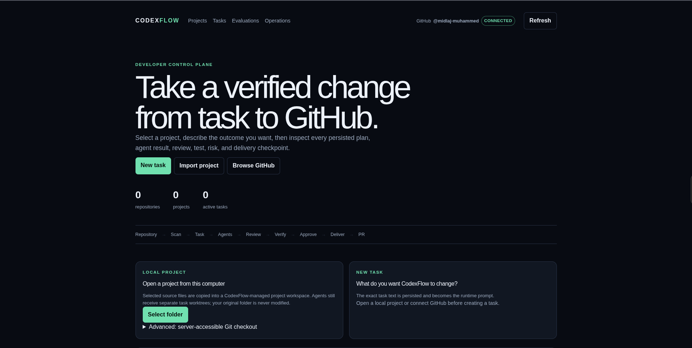
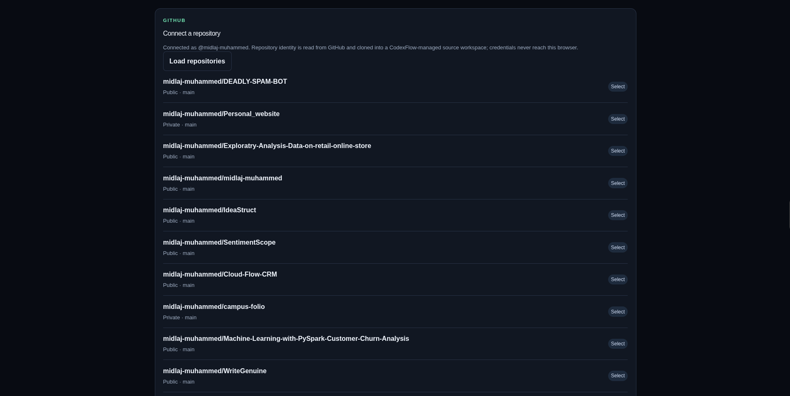
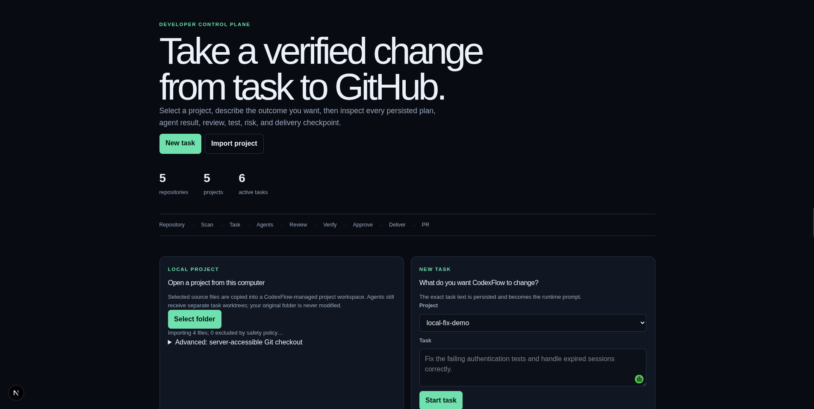

# CodexFlow

## Overview

CodexFlow is an AI coding-agent control plane for planning, coding, reviewing,
testing, approving, and safely delivering verified software changes to GitHub.

Instead of letting an AI agent directly change a main branch, CodexFlow places a
controlled workflow around the agent:

```text
Developer
  -> GitHub or local project
  -> Task
  -> Supervisor
  -> Planner
  -> Coder / Specialist
  -> Reviewer
  -> Tester
  -> Repair if needed
  -> Evaluation and risk
  -> Human approval
  -> Commit
  -> Push
  -> GitHub pull request
  -> SHA verification
```

Live application:
[https://codexflow.onrender.com/](https://codexflow.onrender.com/)

Repository:
[https://github.com/midlaj-muhammed/codexflow](https://github.com/midlaj-muhammed/codexflow)

## Problem Statement

AI coding agents can generate useful code, but handing them direct control over
a repository creates serious workflow gaps:

- Developers need to know what the agent planned before it changes code.
- Generated changes must run in an isolated workspace, not directly on the main
  branch.
- Test results must come from real command execution, not model claims.
- Risk, review, and approval need to be visible before delivery.
- GitHub delivery must be traceable and recoverable.
- Pull requests should only be considered valid when the delivered commit,
  remote branch, and PR head SHA all agree.

The core problem CodexFlow solves is: how can developers use AI coding agents
without losing control over verification, approval, Git safety, and GitHub
delivery?

## Solution

CodexFlow acts as the control plane between the developer, AI coding agents,
Git, verification infrastructure, and GitHub.

It stores projects, tasks, agent runs, verification results, approvals,
delivery records, and evaluation evidence. A RuntimeExecutor coordinates the
real execution lifecycle, while an OrchestrationSupervisor deterministically
selects a strategy for the task:

- `BUG_FIX`
- `REFACTOR`
- `SECURITY`
- `TEST_GENERATION`

Each task runs through bounded specialist stages such as Planner, Coder,
SecurityReviewer, TestGenerator, Reviewer, Tester, and Repair. Code changes are
made inside isolated Git worktrees. Delivery is blocked until backend approval
and final verification succeed.

For GitHub delivery, CodexFlow verifies this invariant:

```text
delivery commit SHA = remote branch SHA = GitHub PR head SHA
```

If those values do not match, delivery is treated as unsafe.

## Features

- Public landing page and internal dashboard for project and task workflows.
- GitHub OAuth login with server-side encrypted session handling.
- GitHub App installation guidance when the app is authorized but not installed.
- Repository browsing from the authenticated GitHub account.
- GitHub repository import through a CodexFlow-managed clone.
- GitHub App installation-token based clone support for GitHub App deployments.
- Local project import through browser folder selection.
- Project scanning and metadata detection.
- Natural-language task prompt creation.
- Deterministic orchestration strategies for bug fixes, refactors, security
  work, and test generation.
- Real specialist stages: Planner, Coder, SecurityReviewer, TestGenerator,
  Reviewer, Tester, and Repair.
- Isolated Git worktrees for agent execution.
- Sensitive-file and unsafe-path protections.
- Command execution controls for tests, lint, typecheck, build, and project
  health checks.
- Stage timeout, overall timeout, cancellation, bounded repair, and execution
  leases.
- Backend-enforced human approval before delivery.
- Durable commit, push, and pull-request delivery records.
- GitHub PR title/body generation from persisted execution evidence.
- GitHub SHA reconciliation for delivered pull requests.
- Evaluation records with strategy and stage provenance.
- Readiness and operations endpoints for runtime visibility.

## Tech Stack

- _Frontend:_ Next.js 16, React 19, TypeScript, CSS
- _Backend:_ Next.js API routes, Node.js, RuntimeExecutor, OrchestrationSupervisor
- _Database:_ SQLite for the main CodexFlow control-plane store; PostgreSQL /
  Supabase connection for encrypted GitHub OAuth session persistence
- _APIs / Services:_ OpenAI API, GitHub REST API, GitHub OAuth, GitHub App
  installation tokens
- _Hosting / Deployment:_ Render Docker web service with Git installed and a
  persistent disk
- _Other Tools:_ pnpm, Turborepo, Vitest, Playwright, ESLint, TypeScript, Git CLI

## Codex / OpenAI Usage

Codex, ChatGPT, and OpenAI tools were used throughout the hackathon build as an
engineering partner.

AI helped with:

- Ideation and product framing for CodexFlow as an agent control plane.
- Architecture planning for RuntimeExecutor, OrchestrationSupervisor, specialist
  stages, approval, delivery, and evaluation.
- Code generation across the Next.js UI, API routes, runtime packages, GitHub
  integration, and testing layers.
- Debugging OAuth, Render deployment, GitHub App installation, Git clone, local
  project import, and database/session issues.
- Test design for deterministic runtime, provider, Git, database, and frontend
  behavior.
- Documentation and audit writing for the implemented roadmap.
- UI/UX development for the landing page, dashboard, project onboarding, GitHub
  flow, local folder import, and task workflow.

OpenAI is also part of the product itself: provider-backed agent stages use
structured model output to plan and generate controlled code edits. Those model
outputs are validated before edits are applied.

## Demo

### Live Demo

[Open CodexFlow](https://codexflow.onrender.com/)

### Demo / Pitch Video

Demo video: not added yet.

A good demo flow is:

1. Open the CodexFlow landing page.
2. Continue with GitHub.
3. Install/authorize the GitHub App if prompted.
4. Browse repositories.
5. Select and scan a repository.
6. Create a natural-language task.
7. Let CodexFlow execute the agent workflow.
8. Review plan, agent activity, verification, and risk.
9. Approve the change.
10. Deliver it as a GitHub pull request.

## Screenshots









## How to Run Locally

CodexFlow uses pnpm workspaces.

```bash
git clone https://github.com/midlaj-muhammed/codexflow.git
cd codexflow
pnpm install
cp .env.example .env
pnpm dev
```

Useful development commands:

```bash
pnpm lint
pnpm typecheck
pnpm test
pnpm test:e2e
```

External E2E commands require real configured credentials and disposable test
resources:

```bash
pnpm test:openai-e2e
pnpm test:github-e2e
```

### Required Environment Variables

For local UI development, most values can be left empty. For real provider,
GitHub, and deployment flows, configure the relevant server-side variables in
`.env` or your host's secret environment settings.

```env
OPENAI_API_KEY=

CODEXFLOW_DATABASE_PATH=/tmp/codexflow-control-plane.sqlite
CODEXFLOW_PROJECT_ROOT=/tmp/codexflow/projects
CODEXFLOW_WORKSPACE_ROOT=/tmp/codexflow/workspaces

DATABASE_URL=

GITHUB_OAUTH_CLIENT_ID=
GITHUB_OAUTH_CLIENT_SECRET=
CODEXFLOW_SESSION_SECRET=
CODEXFLOW_PUBLIC_URL=https://codexflow.onrender.com

GITHUB_APP_SLUG=
GITHUB_APP_INSTALL_URL=
GITHUB_APP_ID=
GITHUB_APP_PRIVATE_KEY=
GITHUB_APP_PRIVATE_KEY_BASE64=
```

Do not commit real `.env` files, GitHub tokens, OpenAI keys, private keys, OAuth
client secrets, or session secrets.

## Additional Notes

CodexFlow is GitHub-only by design for this roadmap. GitLab and Bitbucket are
not implemented.

The full runtime requires a persistent Node deployment with:

- Git CLI installed
- writable durable storage for managed repositories and task worktrees
- persistent SQLite storage for the control-plane database
- server-side environment variables for OpenAI and GitHub integration

The Render deployment is the intended full-product deployment shape. Vercel can
serve UI/API routes, but standard serverless functions are not a complete host
for CodexFlow task execution because they do not provide the persistent
filesystem and process behavior required for Git worktrees and agent execution.

For GitHub App OAuth deployments, the GitHub App must be installed on the
account or repository being imported. The app needs at least:

- Repository contents: read and write
- Pull requests: read and write

CodexFlow uses the signed-in user session for repository selection and mints a
short-lived GitHub App installation token for managed clone/import.

Known limitations:

- Demo/pitch video is not included yet.
- External E2E tests require configured disposable OpenAI and GitHub resources.
- GitHub App private key and OAuth secrets must be configured in the deployment
  environment before the full GitHub workflow can run.
- Token/cost metrics are only shown when actual persisted provider data exists.
- Horizontal scaling is not supported with the current single SQLite database
  and single mounted worktree volume.

License: not currently specified.
